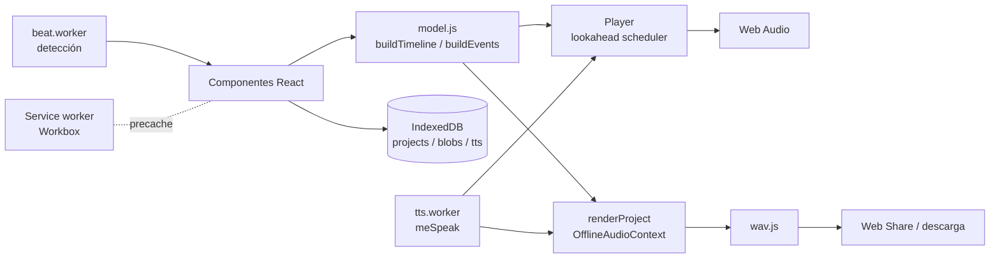

# Queue it: arquitectura y stack tecnológico

Queue it es una PWA para músicos que arma **guías de ensayo y de escenario**: una pista de click (metrónomo por secciones o pulso detectado sobre un audio) con **cues** de voz sintética, grabaciones propias o notas de texto ancladas a un compás y un tiempo. Cada pista se puede exportar.

## Principios

| Principio | Decisión |
|---|---|
| Sin backend, sin cuenta | Todo vive en el navegador (IndexedDB). No hay servidor que mantener. |
| 100 % offline | Service worker precachea la app completa, incluido el motor de voz y las fuentes. |
| Android primero | Interfaz oscura para teléfono, instalable como WebAPK desde Chrome. Sin tiendas. |
| Código abierto | Solo dependencias libres. La licencia del proyecto es AGPL-3.0-or-later (ver Licencias). |
| Posiciones musicales | Los cues se guardan como `compás:tiempo`, no en segundos. Si cambia un tempo, los cues se mueven solos. |

## Stack

| Capa | Tecnología | Por qué |
|---|---|---|
| UI | React 19 + CSS propio | Ya estaba en el repo; sin framework CSS para mantener el bundle chico. |
| Build | Vite 8 (Rolldown) | Workers como módulos ES, build rápido. |
| PWA | `vite-plugin-pwa` (Workbox, `generateSW`) | Manifest, service worker y precache sin configuración manual. |
| Audio | Web Audio API | Programación con precisión de muestra, render offline con `OfflineAudioContext`. |
| Voz sintética | `mespeak` (eSpeak compilado a JS) en un Web Worker | Genera WAV en el propio teléfono, sin red, y se puede mezclar y exportar. |
| Grabación | `MediaRecorder` (Opus/WebM) | Nativo en Chrome Android. |
| Detección de pulso | `essentia.js` (WASM) en un Web Worker, con detector propio de respaldo | Acierta los pulsos también en música sin batería; corre sin red (el WASM va embebido y precacheado). Es AGPL-3.0. |
| Persistencia | IndexedDB vía `idb` | Guarda blobs de audio grandes sin límite práctico de tamaño. |
| Fuentes | `@fontsource` Barlow Condensed + Atkinson Hyperlegible | Empaquetadas localmente (offline). Hyperlegible para leer con poca luz. |
| Distribución | GitHub Pages + GitHub Actions | HTTPS gratis, requisito para instalar la PWA. |

## Estructura de carpetas

```
src/
  App.jsx                 rutas por hash (#/ y #/p/<id>)
  main.jsx                entrada, fuentes, estilos
  styles/app.css          tokens de diseño y estilos
  components/
    Home.jsx              lista de pistas, crear, importar
    Editor.jsx            pantalla principal: pestañas + transporte
    TrackMap.jsx          mapa de la pista a escala (tocar = ir al compás)
    SectionsPanel.jsx     secciones de metrónomo (tempo, compás, accel./rit.)
    AudioPanel.jsx        audio subido: detección y ajuste de la grilla
    Waveform.jsx          forma de onda con pulsos (canvas)
    CuesPanel.jsx         lista de cues
    CueSheet.jsx          editar cue: posición, tipo, texto, grabación
    SettingsPanel.jsx     mezcla, voz, eliminar pista
    ExportSheet.jsx       WAV, hoja .txt, respaldo .json
    StageView.jsx         modo escenario: números grandes
    Sheet.jsx, Stepper.jsx, icons.jsx
  lib/
    model.js              modelo de datos + línea de tiempo (puro, testeable en Node)
    db.js                 IndexedDB
    useProject.js         carga y autoguardado con debounce
    share.js              Web Share / descarga, respaldo e importación
    wakeLock.js           pantalla encendida durante la reproducción
    audio/
      context.js          AudioContext único y caché de decodificación
      engine.js           Player (en vivo) y renderProject (offline)
      clicks.js           sonidos de click sintetizados
      tts.js / tts.worker.js      voz sintética
      beat.js / beat.worker.js / beatDetect.js   detección de pulso
      recorder.js         grabación de voz
      wav.js              codificador WAV 16 bits
```



## Modelo de datos

Un proyecto es un objeto JSON guardado en el store `projects`. Los audios (pista subida y grabaciones) van aparte en el store `blobs` y se referencian por `blobId`.

```json
{
  "id": "…", "schema": 1, "kind": "metronome | audio", "title": "Mi canción",
  "sections": [
    { "id": "…", "name": "Intro", "bars": 4, "bpm": 100, "bpmEnd": null, "num": 4, "den": 4 }
  ],
  "audio": { "blobId": "…", "name": "tema.mp3", "mime": "audio/mpeg", "duration": 212.4 },
  "grid": { "mode": "detected | fixed", "bpm": 110, "offset": 0.52, "num": 4,
            "beats": [0.52, 1.07, "…"], "downbeat": 0, "nudge": 0 },
  "cues": [
    { "id": "…", "bar": 17, "beat": 1, "kind": "tts | voice | text", "text": "Coro", "blobId": null, "gain": 1 }
  ],
  "mix": { "click": 0.8, "track": 1, "cues": 1, "clickOnAudio": false },
  "tts": { "voice": "es-la", "speed": 160, "pitch": 45 }
}
```

`schema` permite migrar proyectos cuando el modelo cambie.

## Línea de tiempo

`buildTimeline(project)` convierte la estructura musical en una lista de pulsos con tiempo absoluto `{ t, bar, beat, num, section, accent, bpm }` y una lista de compases. Es la única fuente de verdad para reproducir, exportar, dibujar y ubicar cues.

**Metrónomo.** Recorre las secciones en orden. El BPM cuenta la figura del denominador (en 6/8 a 180 bpm suena cada corchea). En una sección con `bpmEnd` el tempo se interpola linealmente pulso a pulso, lo que da un accelerando o ritardando continuo. Los acentos son: tiempo 1 fuerte y, en compases compuestos (6/8, 9/8, 12/8), un acento secundario cada tres corcheas.

**Audio.** En modo `detected` usa los tiempos de pulso detectados, y `downbeat` indica cuál es el primer tiempo del compás 1 (los anteriores forman una anacrusa, compás 0). En modo `fixed` genera una grilla regular desde `offset` con el BPM indicado. `nudge` desplaza toda la grilla unos milisegundos.

## Motor de audio

**Eventos compartidos.** `buildEvents()` genera la lista ordenada de clicks y cues. El `Player` y el render offline consumen exactamente la misma lista, así lo que se escucha en vivo es lo mismo que se exporta.

**Grafo.** Tres buses de ganancia (`click`, `track`, `cue`) van a un compresor-limitador maestro y de ahí a la salida. Los volúmenes cambian en vivo desde Ajustes.

**Scheduler.** Cada 100 ms se programan los eventos de los próximos 1,5 s con `AudioBufferSourceNode.start(t)`. El margen amplio tolera que Chrome ralentice los timers en segundo plano, y al detener se cancelan todos los nodos pendientes. El `AudioContext` usa `latencyHint: 'playback'` (buffers más grandes, menos cortes en Android); la posición en pantalla compensa `outputLatency`.

**Fin de la reproducción.** El `Player` se detiene al terminar la estructura más la duración del cue más largo, para no cortar una frase de voz que cae en el último compás.

**Render offline.** `renderProject()` crea un `OfflineAudioContext` estéreo a 44,1 kHz, programa todos los eventos de una vez y codifica el resultado a WAV de 16 bits.

**Memoria.** Los audios decodificados ocupan unos 10 MB por minuto (estéreo, 44,1 kHz). `context.js` los guarda en una caché LRU de 6 entradas para que abrir varias pistas no sature el teléfono.

**Clicks.** Se sintetizan en código (seno con armónico y envolvente exponencial), sin samples externos.

## Voz sintética

`speechSynthesis` del navegador no sirve para este caso: no se puede capturar su audio (no hay exportación), su latencia es impredecible y no existe dentro de un WebView. Por eso la voz se genera con **meSpeak** dentro de un Web Worker, que devuelve un WAV en memoria. Ese audio se decodifica y se programa como cualquier otro evento, con precisión de muestra.

Cada frase generada se guarda en el store `tts` con la clave `voz|velocidad|tono|texto`, así solo se sintetiza una vez. Las variantes disponibles son español latinoamericano y de España.

**Limitación.** eSpeak suena robótico. La interfaz de `tts.js` (`ttsBuffer(text, settings)`) está aislada para cambiar de motor sin tocar el resto (ver Hoja de ruta).

`ESpeak.js` trae comentarios en Latin-1 y Rolldown exige UTF-8. El plugin `mespeakLatin1` de `vite.config.js` lo lee como Latin-1 en build y en workers.

## Detección de pulso

Corre en `beat.worker.js` para no congelar la interfaz. Hay dos motores:

**1. essentia.js (principal).** Algoritmo `RhythmExtractor2013` de Essentia (WASM, se carga con `import()` dentro del worker). Devuelve la posición de cada pulso y un tempo estimado.

- Exige **44,1 kHz mono**. Android suele decodificar a 48 kHz, así que `beat.js` remuestrea y mezcla a mono con un `OfflineAudioContext` antes de enviar el audio al worker.
- Método por defecto: **`degara`** (`BeatTrackerDegara`): rápido y, en las pruebas, igual de bueno que el otro. El botón "Probar otro método" usa **`multifeature`**, más lento y que sirve como segunda opinión cuando el primero falla. No es estrictamente mejor: ver Verificación.
- El wasm va embebido en el JS (base64, ~2,5 MB) y el service worker lo precachea, de modo que funciona sin conexión.
- El tempo mostrado es el de essentia, salvo que se aleje más de un 3 % de la mediana de los intervalos de los pulsos (error de octava o pulsos perdidos); ahí manda la mediana.
- Essentia no informa avance: la interfaz muestra una barra indeterminada con la etapa actual.

**2. Detector propio (respaldo, `beatDetect.js`).** Flujo espectral, autocorrelación con prior en 120 bpm y seguimiento por programación dinámica (Ellis, 2007). Se usa solo si essentia no carga o no encuentra pulsos, y la interfaz avisa. **Limitación conocida:** en música sin percusión acierta el tempo pero suele colocar los pulsos en el lugar equivocado (p. ej. sobre las corcheas). Por eso dejó de ser el motor principal.

**Primer tiempo del compás.** Para ambos motores lo estima `downbeatFromBeats()`: la fase, entre las `num` posibles, con más energía de graves y de onset en sus pulsos (el bombo o el bajo suelen caer en el 1). Es una heurística: en música sin graves marcados puede equivocarse, y por eso existen los botones **−1 pulso / Aquí / +1 pulso**.

Ajustes manuales siempre disponibles: **½×** y **2×** (errores de octava), ajuste fino en ms, modo **Tempo fijo** con *tap tempo* y tiempos por compás.

A diferencia de Moises, no usa redes neuronales de separación de fuentes: con música muy rubato o sin pulso estable la detección seguirá siendo aproximada.

## Persistencia

IndexedDB `queue-it`, versión 1:

| Store | Clave | Contenido |
|---|---|---|
| `projects` | `id` | Objeto proyecto |
| `blobs` | `blobId` | `Blob` del audio subido o de las grabaciones |
| `tts` | `voz\|vel\|tono\|texto` | `ArrayBuffer` WAV de frases sintetizadas |

El autoguardado usa un debounce de 400 ms y además guarda al salir de la pantalla o al pasar la app a segundo plano. Al iniciar se llama a `navigator.storage.persist()` para que Android no borre los datos por falta de espacio. Al eliminar una pista se descarta cualquier guardado pendiente (`discard`) para que el debounce no la vuelva a crear. Aun así conviene exportar respaldos.

## Exportación

| Formato | Contenido |
|---|---|
| **WAV** | Mezcla elegible: pista, click y cues. Render offline. |
| **Hoja de cues (.txt)** | Secciones, compases, métrica, tempo y cues, legible en WhatsApp o impreso. |
| **Respaldo (.json)** | Proyecto con los audios embebidos en base64. Se importa en otro teléfono desde "Nueva pista → Importar respaldo". |

El archivo se genera primero y después el usuario toca **Compartir** (menú nativo de Android vía Web Share API) o **Guardar** (descarga). Son dos pasos porque Android exige un toque reciente para abrir el menú de compartir y el render puede tardar.

## PWA y offline

`vite-plugin-pwa` genera `sw.js` con Workbox. La lista de precache incluye todo el JS (el worker de voz pesa unos 1,7 MB), CSS, fuentes e íconos; el límite por archivo se subió a 12 MB. `base: './'` hace que funcione tanto en la raíz como bajo `/Queue_it/` en GitHub Pages. `registerType: 'autoUpdate'` actualiza la app en segundo plano cuando hay una versión nueva publicada.

**Instalación en Android.** Abre la URL de GitHub Pages en Chrome, luego menú → "Instalar app". Chrome genera un **WebAPK**: ícono en el cajón, pantalla completa, sin barra de navegador. Desde ahí funciona sin conexión.

## Detalles específicos de Android

- **Pantalla encendida**: Screen Wake Lock durante la reproducción, que se vuelve a pedir al regresar a la app.
- **Botón atrás**: rutas por hash y cada hoja inferior agrega una entrada al historial, así "atrás" cierra la hoja o vuelve a la lista.
- **Segundo plano**: si el usuario cambia de app, Chrome puede pausar el audio. Para escenario, usar el modo escenario con la pantalla encendida. El audio en segundo plano confiable requiere un servicio nativo (ver Hoja de ruta).
- **Latencia**: no afecta, porque todo se programa por adelantado y no hay monitoreo de entrada en vivo.

## Licencias

El proyecto se distribuye bajo **AGPL-3.0-or-later** (archivo `LICENSE`, declarado en `package.json`). Dos dependencias lo condicionan:

- **`essentia.js`** es **AGPL-3.0** (Essentia: "versión 3 o posterior"). Es la más restrictiva: obliga a que quien use la aplicación a través de una red, como esta PWA publicada en GitHub Pages, pueda obtener el código fuente correspondiente. Por eso el código debe permanecer público (lo está) y conviene que la app enlace a su repositorio.
- **`mespeak`/eSpeak** declara **GPL** sin indicar versión. La GPL-3.0 permite combinar su código con AGPL-3.0, pero si eSpeak fuera solo GPL-2.0 habría incompatibilidad. Según el historial de eSpeak la versión es 3 o posterior, pero **no se verificó contra el paquete**: conviene confirmarlo antes de distribuir el proyecto más allá de uso personal.

Si algún día se necesita una licencia más permisiva, habría que reemplazar `essentia.js` (p. ej. por el detector propio de respaldo) y el motor de voz. El resto de las dependencias (React, Vite, idb, Workbox) son MIT, ISC o Apache-2.0, y las fuentes usan la licencia OFL. Todas son compatibles.

## Desarrollo

```bash
npm install
npm run dev        # http://localhost:5173 (el SW solo se activa en build)
npm run build && npm run preview   # prueba la PWA real, offline incluido
npm run lint
npm test            # tests del modelo con node:test (sin dependencias)
```

Para probar en el teléfono durante el desarrollo, usa `npm run dev -- --host` en la misma red Wi-Fi. Ten en cuenta que el micrófono y la instalación exigen HTTPS o `localhost`: usa *port forwarding* de `chrome://inspect` con el teléfono por USB.

**Publicar.** Al hacer push a `main`, el workflow `.github/workflows/deploy.yml` compila y publica en GitHub Pages. Actívalo una vez en Settings → Pages → Source: **GitHub Actions**.

## Verificación de la detección de pulso

Música **sin batería** generada para la prueba (guitarra punteada en corcheas, piano suave y cuerdas con ataque lento, a 76, 92 y 104 bpm, a 44,1 y 48 kHz, más un caso con rubato del ±3 %). La métrica es la **F-measure de pulsos con tolerancia de ±70 ms** (1,0 = todos los pulsos bien colocados).

| Caso | Detector anterior | essentia `degara` | essentia `multifeature` |
|---|---|---|---|
| Guitarra 92 bpm | 0,00 | 0,99 | 0,99 |
| Piano 76 bpm | 0,58 | 0,97 | 0,98 |
| Cuerdas 104 bpm | 0,18 | 0,98 | 0,98 |
| Guitarra con rubato | 0,00 | 0,99 | **0,03** |
| Canción de 4 min, estéreo, 48 kHz | — | 1,00 (6 s) | 1,00 (20 s) |

Lo que muestra: el detector anterior acertaba el tempo (92,3 bpm) pero colocaba los pulsos fuera de fase, que es el síntoma "no marca bien el tiempo"; essentia lo corrige. `multifeature` no es mejor que `degara`, es 3–4 veces más lento y falló con rubato, por eso es la opción secundaria. Medido en Chrome con la app real, el primer tiempo del compás salió correcto en los 7 casos.

**Límites de esta prueba:** es audio sintético, no música grabada, con pulso estable y ataques claros. No sustituye probar con tus canciones. Los tiempos son de un PC; en un teléfono espera varias veces más (el modo por defecto debería seguir siendo cuestión de segundos para una canción normal, pero no se midió en un Android).

Además se probó sin conexión con el service worker activo (la detección usa essentia, sin aviso de respaldo) y con essentia bloqueado (se usa el detector propio y se muestra un aviso). `tests/beat.test.js` fija el caso de la guitarra como regresión: el detector anterior lo reprueba (F = 0,00).

## Verificación hecha

Tests automáticos (`npm test`, 12 casos: 10 en `tests/model.test.js` y 2 de detección en `tests/beat.test.js`). Los del modelo cubren: duración por compás, secciones con distinto tempo y compás encadenadas, acentos de 6/8, accelerando, cues anclados a compás:tiempo que siguen al tempo, cues fuera de la estructura, anacrusa y `downbeat` en audio.

Prueba en Chrome con viewport de teléfono (393×851) sobre el build de producción: crear pista de metrónomo, reproducir (posición correcta tras 2,5 s a 100 bpm), cue de voz sintética (0,8 s la primera vez), exportar WAV (2,0 MB), recargar con la red cortada (el service worker sirve la app), subir un WAV de 120 bpm (detecta 120,2 bpm en 0,3 s) y eliminar una pista con un guardado pendiente (no reaparece).

Verificación anterior, ya incluida en el flujo:

Flujo completo probado en Chromium con viewport de teléfono (390×844): crear una pista de metrónomo con tres secciones (4/4, 3/4 y accelerando), agregar cues de voz y de texto, reproducir, abrir el modo escenario, exportar el WAV (la voz aparece en el compás correcto), exportar la hoja, crear una pista desde audio (110 bpm detectado exacto, compás 1 en el bombo), reproducir el audio y recargar sin conexión con el service worker activo.

## Hoja de ruta

1. **Capacitor (APK)**: plugin nativo con `TextToSpeech.synthesizeToFile()` para usar las voces del sistema (mucho más naturales, sin peso extra), un foreground service para audio en segundo plano y `keep-awake`. El código web actual se reutiliza tal cual.
2. **Mejor voz offline en la PWA**: Piper vía `sherpa-onnx` WASM (voces de 20–60 MB descargadas una vez), detrás de la misma interfaz `ttsBuffer()`.
3. **Cues con anticipación**: que la voz empiece N tiempos antes del compás marcado, para decir "coro en dos" y que el coro caiga en su lugar.
4. **Cuenta inicial** configurable, loops de sección para ensayo y listas de canciones (setlists).
5. **Exportar a Opus/MP3** para archivos más livianos.
6. **Mejor detección del primer tiempo y de cambios de compás**: hoy el primer tiempo es una heurística de energía de graves y la grilla tiene un único compás por pista. Un modelo de beat y downbeat (p. ej. vía ONNX Runtime Web) podría mejorarlo.
7. **Más tests**: `model.js` ya tiene cobertura con `node:test`; falta `beatDetect.js` (es puro y se puede probar en Node con audio sintético) y un test de humo con Playwright.
